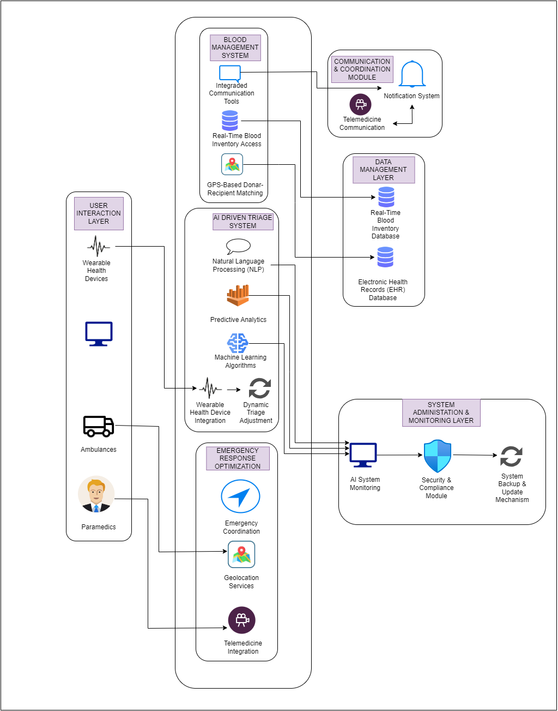
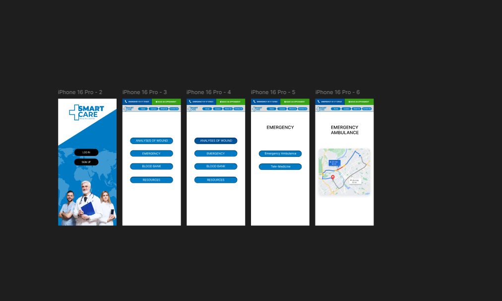
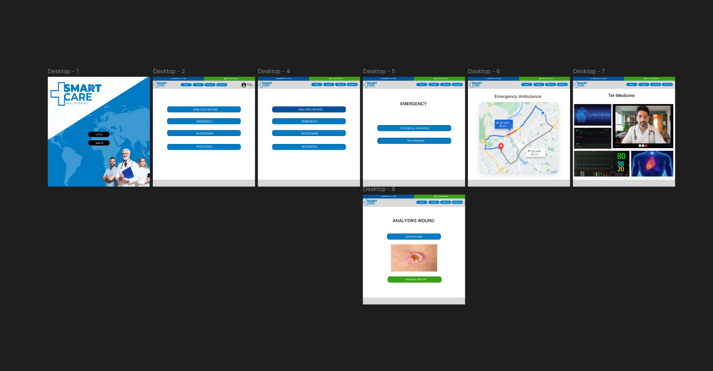

# Advanced Intelligent Efficient Hospital Admissions and Emergency Situations (SmartCare)
24-25j-311 Research Project
| Group Member ID | Name  | Research Component |
|------------------|------------------|------------------|
| IT21114830  | Sri Harisha P.A.D.T     | Emergency Response System |
| IT21313998    | Rasara S.H.K    | Smart Blood Management |
| IT21276378    | Kusumsiri B.S.M.D.S    | Ai-Driven Triage System |
| IT21232886    | Nimsara M.K.C    | Intelligent Resource Management |

Introduction

SmartCare revolutionizes emergency healthcare in Sri Lanka by addressing critical patient care and resource management challenges. The AI-driven triage system rapidly assesses and prioritizes patients. SmartCare's intelligent resource management uses AI and IoT to optimize hospital resources, predict needs, and dynamically schedule staff to prevent burnout. Geolocation services speed up emergency response, and telemedicine enables instant specialist consultations. For blood management, a real-time dashboard and GPS features streamline donation and distribution, enhancing reliability.

Git repo - https://github.com/DinethSenura/Smart-Care.git

System Overview Diagram 

.


All the related UI included in figma.

Figma Link - https://www.figma.com/design/7qmNNeZCSOWBiGWyJOw1VF/Untitled?node-id=0-1&t=BdkGjEcSqMZ1h7qc-1

Sample UI




# Mobile


## Get started

1. Install dependencies

   ```bash
   npm install
   ```

2. Start the app

   ```bash
    npx expo start
   ```
   
  # Web

  ## Get started

1. Install dependencies

   ```bash
   npm install
   ```

2. Start the app

   ```bash
    npm start 
   ```
   
