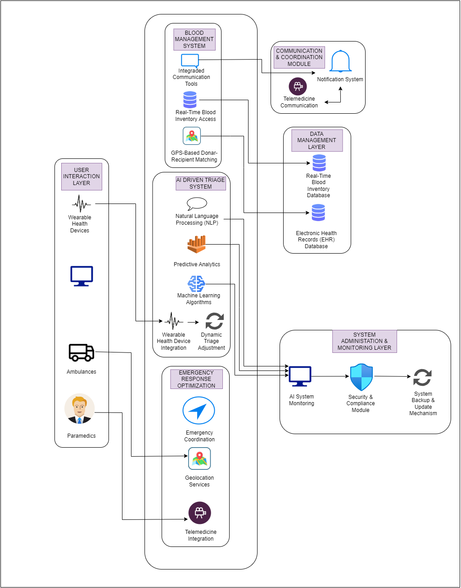

# Advanced Intelligent Efficient Hospital Admissions and Emergency Situations (SmartCare)
24-25j-311 Research Project
| Group Member ID | Name  | Research Component |
|------------------|------------------|------------------|
| IT21114830  | Sri Harisha P.A.D.T     | Emergency Response System |
| IT21313998    | Rasara S.H.K    | Smart Blood Management |
| IT21276378    | Kusumsiri B.S.M.D.S    | Ai-Driven Triage System |
| IT21232886    | Nimsara M.K.C    | Intelligent Resource Management |

Introduction

SmartCare revolutionizes emergency healthcare and resource management in Sri Lanka through cutting-edge AI, IoT, and geolocation technologies. It features an AI-driven triage system for rapid patient prioritization, intelligent resource management to optimize hospital operations and prevent staff burnout, geolocation services for swift emergency responses, telemedicine for instant specialist consultations, and a real-time blood management dashboard to streamline donation and distribution. By enhancing efficiency, reliability, and patient outcomes, SmartCare is transforming Sri Lanka's healthcare system.

Git repo - https://github.com/DinethSenura/Smart-Care.git

System Overview Diagram 




All the related UI included in figma.

Figma Link - https://www.figma.com/design/7qmNNeZCSOWBiGWyJOw1VF/Untitled?node-id=0-1&t=BdkGjEcSqMZ1h7qc-1

Sample UI


# Mobile


## Get started

1. Install dependencies

   ```bash
   npm install
   ```

2. Start the app

   ```bash
    npx expo start
   ```
   
  # Web

  ## Get started

1. Install dependencies

   ```bash
   npm install
   ```

2. Start the app

   ```bash
    npm start 
   ```
   
